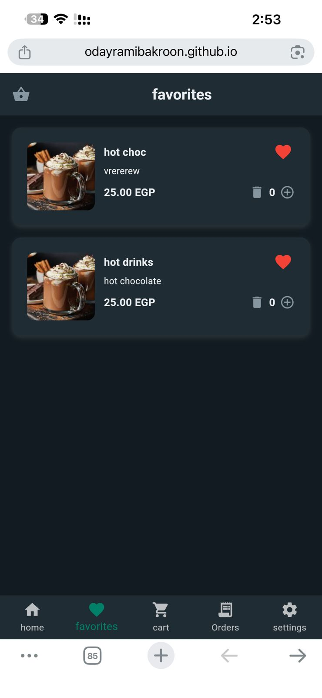
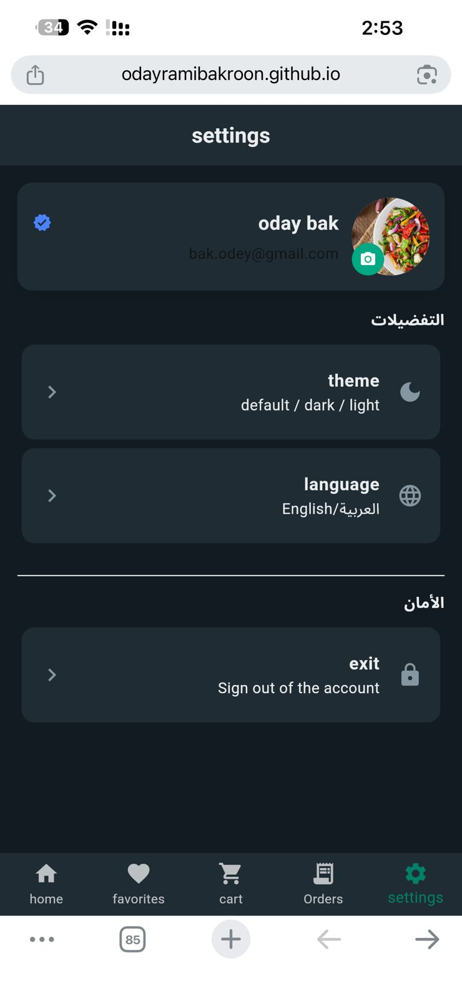
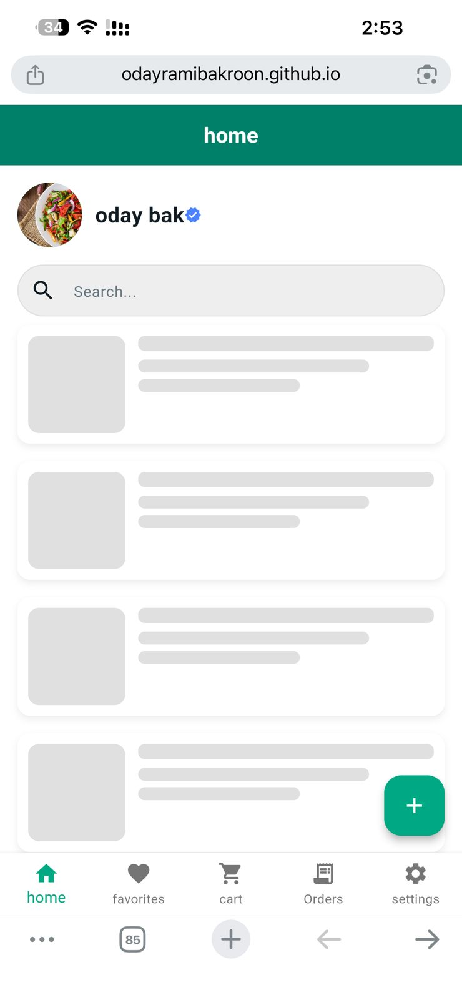
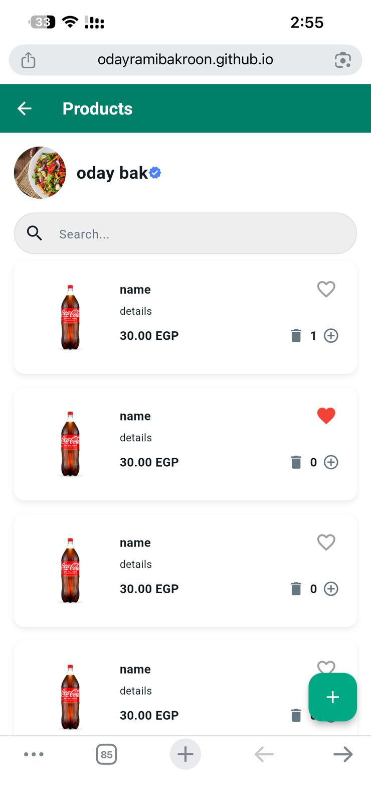
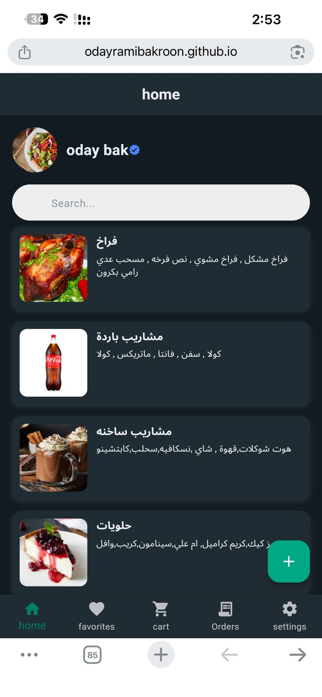
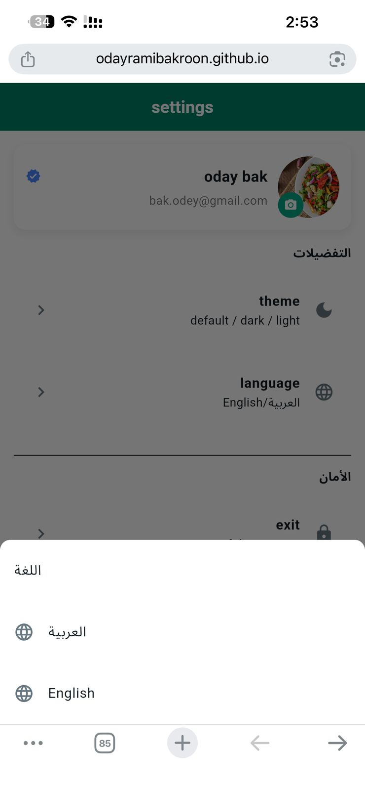
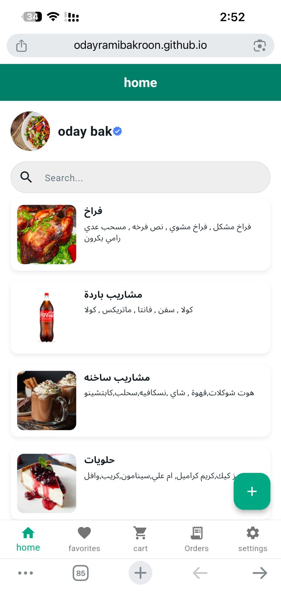
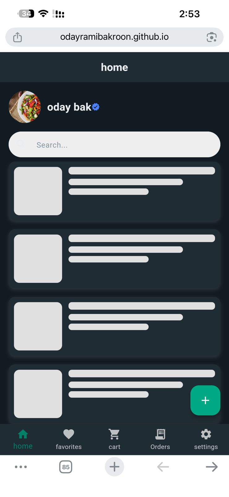
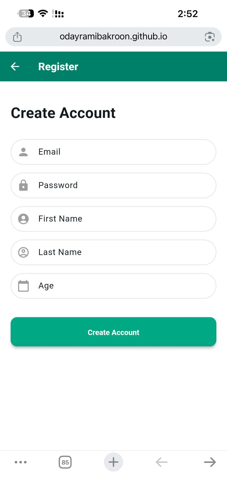

# 🛍️ Target Shop - Flutter E-Commerce App 2026

Target Shop is a modern Flutter e-commerce mobile application built with **Clean Architecture** and **BLoC** state management.

The app supports **Arabic & English**, **Dark Mode**, **Light Mode**, Firebase Authentication, Cloud Firestore, Categories, Products, Favorites, Shopping Cart, Profile Management, and Responsive UI.

---

## ✨ Features

- 🔐 Login & Register
- 🏠 Home Screen
- 📂 Product Categories
- 🛍️ Products by Category
- ❤️ Favorites
- 🛒 Shopping Cart
- 👤 Profile Management
- ⚙️ Settings
- 🌙 Dark & Light Theme
- 🌍 Arabic & English Localization
- 🔥 Firebase Authentication
- ☁️ Cloud Firestore
- 🧩 Clean Architecture
- 🚀 BLoC / Cubit State Management
- 📱 Responsive Design

---

## 🛠 Tech Stack

- Flutter
- Dart
- Firebase
- Cloud Firestore
- Firebase Authentication
- BLoC / Cubit
- Clean Architecture
- StreamBuilder
- Localization
- Material Design

---

## 📂 Project Structure

```text
lib/
├── core/
├── features/
├── config/
├── generated/
└── main.dart
```

---

## 📸 Screenshots

<p align="center">
  
  
  
</p>

<p align="center">
  
  
  
</p>

<p align="center">
  
  
  
</p>

<p align="center">
  
  
  
</p>

---

## 🚀 Getting Started

### Clone the repository

```bash
git clone https://github.com/odayramibakroon/targetshop.git
cd targetshop
```

### Install dependencies

```bash
flutter pub get
```

### Run the application

```bash
flutter run
```

---

## 🔥 Firebase Setup

Configure your own Firebase project before running the application.

```bash
dart pub global activate flutterfire_cli
flutterfire configure
```

Then run:

```bash
flutter pub get
flutter run
```

---

## 🔑 Keywords

Flutter, Flutter E-Commerce, Firebase, Firestore, Flutter Shop, Shopping App, Clean Architecture, BLoC, Cubit, Arabic, English, Dark Mode, Responsive UI.

---

## 👨‍💻 Author

**Oday Rami Bakroon**

GitHub: https://github.com/odayramibakroon
